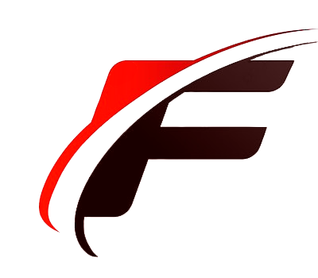

<h1 align="center"><b>Juan David Moreno</b></h1>
<h3 align="center">Hi there! </h3>

  I'm Juan David aka Flexx, I'm from Colombia and I currently in Cali. I'm currently taking FrontEnd Developer courses at Platzi, passionate about technology and     computing.
   
  here you can see my certifications profile in <a href="https://platzi.com/p/Flexx/">@Platzi</a>, Never stop learning!.

<!-- SKILL -->
<h1 align="center">Skills</h1>

  
  
  
  
  

  
  
  
  
  

<!-- SOFTWARES IDES -->
<h1 align="center">Softwares, IDE's, OS's</h1>

    
    
    
    

<!-- LENGUAGES -->
<h1 align="center">Languages</h1>

   
  

<!-- CONTACME -->
<h1 align="center">Contact me</h1>

   
  
  
  
  

<!--
**FlexxN1/FlexxN1** is a ✨ _special_ ✨ repository because its `README.md` (this file) appears on your GitHub profile.

Here are some ideas to get you started:

- 🔭 I’m currently working on ...
- 🌱 I’m currently learning ...
- 👯 I’m looking to collaborate on ...
- 🤔 I’m looking for help with ...
- 💬 Ask me about ...
- 📫 How to reach me: ...
- 😄 Pronouns: ...
- ⚡ Fun fact: ...
-->
